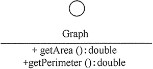
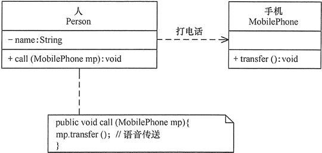
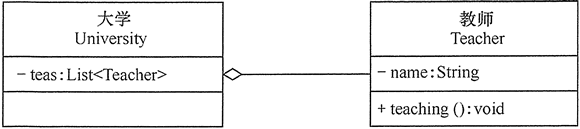
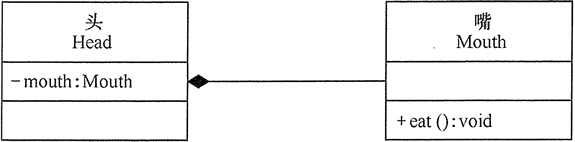

# UML中的类图及类图之间的关系

> 统一建模语言（Unified Modeling Language，UML）是用来设计软件蓝图的可视化建模语言。

## 类、接口和类图

### 类

* 类名（Name）是一个字符串，例如，Student。
* 属性（Attribute）

```
[可见性]属性名:类型[=默认值]
```

* 操作（Operations）

```
[可见性]名称(参数列表)[:返回类型]
```


### 接口

> 用带有名称的小圆圈表示。



### 类图

> 描述类之间关系。


## 类之间的关系

### 依赖关系（Dependency）

> 临时性关联，类的方法通过局部变量、方法的参数或者静态方法来访问另一个类（被依赖类）中的某些方法来完成一些职责。（最弱的耦合关系）




### 关联关系（Association）

> 对象之间的引用关系，即将一个类作为另一个类的成员变量来实现。以下是一般关联关系。


### 聚合关系（Aggregation）

> 一种强关联关系，has-a的关系。成员对象是整体的一部分，成员对象可以脱离整体对象而独立存在。



### 组合关系（Composition）

> 更强烈的聚合关系，是camtains-a关系，一旦整体不存在，部分叶秋不存在了，部分不能脱离整体而存在。



### 泛化关系（Generalization）

> 子类和父类之间的继承关系，is-a的关系，最强的关系。


### 实现关系（Realization）

> 接口与实现类之间的关系。

