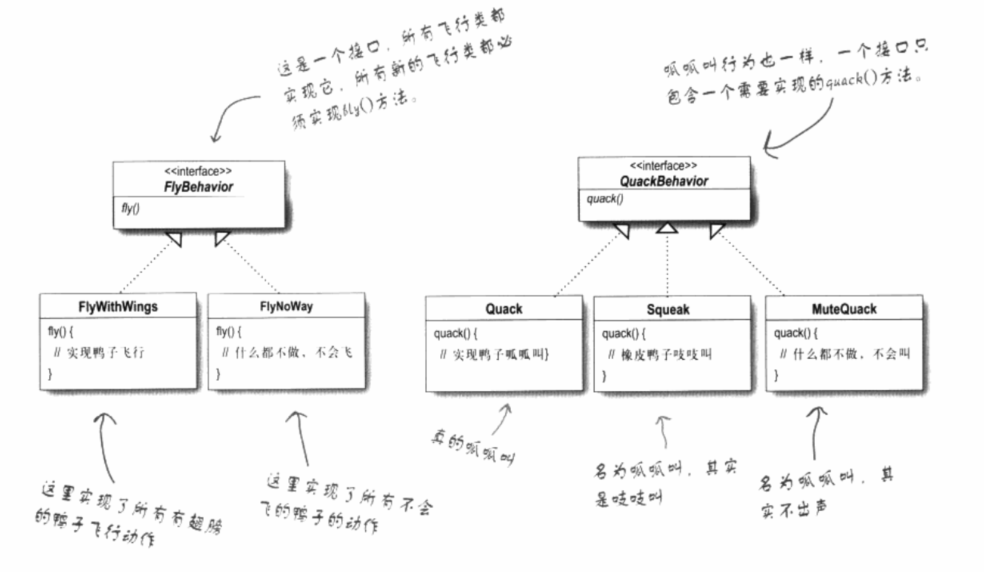

# 设计模式入门

## 分开变化和不变化的部分

## 目的

> 抽象类中，有一个方法在其子类中具体实现中，会遇到某些子类的方法实现不同（部分属性会在未来改变）。
>
> 为了解决以上问题，有两种方法： 1是在抽象类中实现方法，在子类中重写 。2、是设计专门的接口，到子类中实现。
>
> 但两者的复用性不高。
>
> 为了提高复用性，所以才将需要变化的部分拿出来封装。

### 不变部分

>  不变部分在父类中实现。

### 变化的部分

> 单独拿出去作为一个接口，再将接口类作为属性，用具体类实现接口，在具体类中实例化实现调用。

实例中，利用接口来分离出需要变化的方法，在通过具体的类来实现分离出来的接口（多态，实现交给具体子类）。



### 代码实现

* Duck类

```csharp
public class Duck{
    FlyBehavior flyBehavior;
    QuackBehavior quackBehavior;
    
    public void Display(){
        Console.WriteLine("I'm a real dcuk.")
    }
    //委托给方法而不是属性表现行为
    public void performFly(){
        flyBehavior.fly();
    }
    public void performQuack(){
        quackBehavior.quack();
    }
}
//将未来需要改变的实例变量拿出来封装成接口，待后续具体的子类进行实现。
public interface FlyBehavior{
    public void fly();
}
public interface QuackBehavior{
    public void quack();
}
```

* 分离出来的接口的实现类

```csharp
//利用子类实现接口
public Quack : QuackBehavior{
    public void quack(){
        print("呱呱呱")
    }
}

public FlyWithWings : FlyBehavior {
    public void fly(){
        Console.WriteLine("I'm flying.")
    }
}
```

* 接口实例变量的实现

```csharp
public class MallarDuck : Duck {
    //实例化接口类
    public MallardDuck(){
        flyBehavior = new FlyWithWings();
        quackBehavior = new Quack();
    }
    public void display(){
        Console.WriteLine("I'm a real Malladr duck.")
    }
}
```

